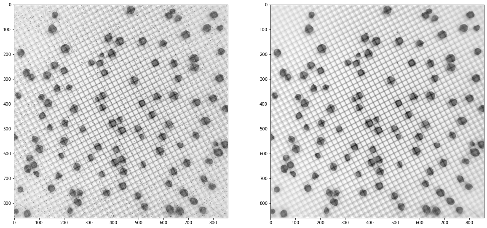
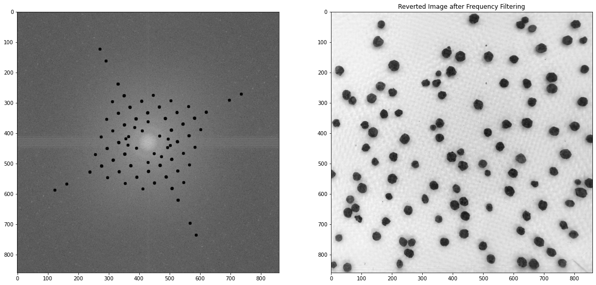
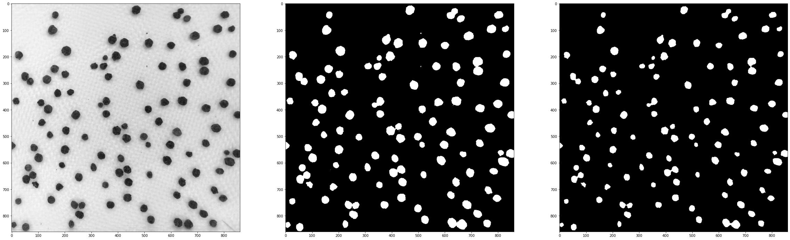
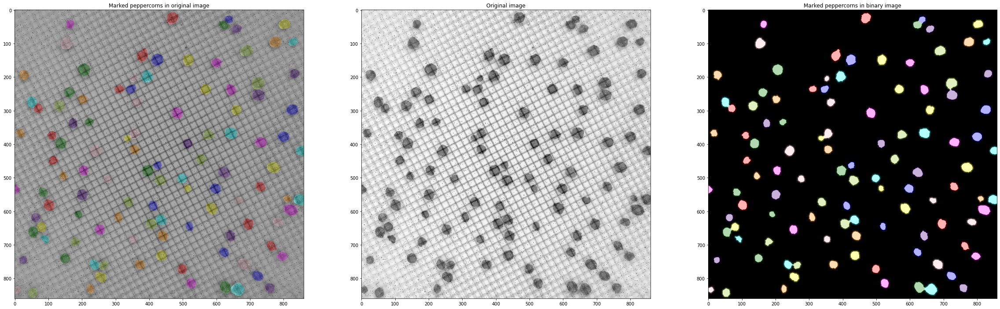

# Project: Digital Image Processing (5. Semester)
## Matrikel-Nr.: 9295660


```python
# import all necessary dependencies
%matplotlib inline
from skimage.feature import peak_local_max
import matplotlib.pyplot as plt
import numpy as np
import tifffile
from numpy.fft import fft
from scipy import ndimage
from skimage.color import label2rgb
from skimage.morphology import disk, erosion
from skimage.segmentation import watershed
from skimage import filters
```


```python
# Path to input file (should be in same directory as notebook)
input_image = tifffile.imread('input.tif')
fig, ax = plt.subplots(ncols=2, figsize=(20, 10))

#Remove salt and petter noise with median filter
denoised_image = ndimage.median_filter(input_image, 3)

ax[0].imshow(input_image, cmap="gray")
ax[1].imshow(denoised_image, cmap="gray")
```


    <matplotlib.image.AxesImage at 0x2399e6d2670>





```python
fig, ax = plt.subplots(ncols=2, figsize=(20, 10))

img_c2 = np.fft.fft2(denoised_image)

img_c3 = np.fft.fftshift(img_c2)

# Calculate mask (Masking of a circle in the center to keep important frequencies)
rows, cols = input_image.shape
crow, ccol = int(rows / 2), int(cols / 2)
r = 65
mask = np.ones_like(input_image)
center = [crow, ccol]
x, y = np.ogrid[:rows, :cols]
mask_area = (x - center[0]) ** 2 + (y - center[1]) ** 2 <= r * r
mask[mask_area] = 0
# Remove high frequencies in images (corresponding to lines)
filter = np.abs(img_c3 * mask) < 75000
# Manually added some frequencies, which belongs to lines
filter[393, 411] = 0
filter[450, 392] = 0
filter[468, 450] = 0
filter[410, 468] = 0
filter = erosion(filter, disk(5))

img_c3 = img_c3 * filter

img_c4 = np.fft.ifftshift(img_c3)

img_c5 = np.fft.ifft2(img_c4)

ax[0].imshow(np.log(1 + np.abs(img_c3)**2), "gray")
ax[1].set_title("Reverted Image after Frequency Filtering")
ax[1].imshow(img_c5.real, "gray")
```


    <matplotlib.image.AxesImage at 0x239a4023bb0>





```python

fig, ax = plt.subplots(ncols=3, figsize=(40, 20))

image_no_grid = img_c5.real.astype(int)

footprint = disk(3)

# Thresholding with otsu-filter
otsu_thresh = filters.threshold_otsu(image_no_grid)

#Binarziation
bin_image = image_no_grid < otsu_thresh

#Errosion to remove small/wrong structures, better separation of peppercorns
erroded_bin_image = erosion(bin_image, footprint)

ax[0].imshow(image_no_grid, "gray")
ax[1].imshow(bin_image, "gray")
ax[2].imshow(erroded_bin_image, "gray")
```


    <matplotlib.image.AxesImage at 0x239a4727610>





```python
# Compute the distance from non-background to background
distance = ndimage.distance_transform_edt(erroded_bin_image)
# Pick the points with high intensity and and defined minimal distance to next point (detect overlapping pixels)
coords = peak_local_max(distance, footprint=disk(10), labels=bin_image, min_distance=4)
mask = np.zeros(distance.shape, dtype=bool)
mask[tuple(coords.T)] = True
markers, _ = ndimage.label(mask)
labels = watershed(-distance, markers, mask=bin_image)
colored_labels = label2rgb(labels, image=input_image, bg_label=0)
labels_on_binary = label2rgb(labels, image=erroded_bin_image, bg_label=0)

fig, ax = plt.subplots(ncols=3, figsize=(40, 20))

ax[1].imshow(input_image, "gray")
ax[1].set_title('Original image')


ax[2].imshow(labels_on_binary)
ax[2].set_title('Marked peppercorns in binary image')

ax[0].set_title('Marked peppercorns in original image')
ax[0].imshow(colored_labels)

```


    <matplotlib.image.AxesImage at 0x239a47f1d90>





```python
print("Count of peppercorns: " + str(markers.max()))
```

    Count of peppercorns: 110


```python

```
